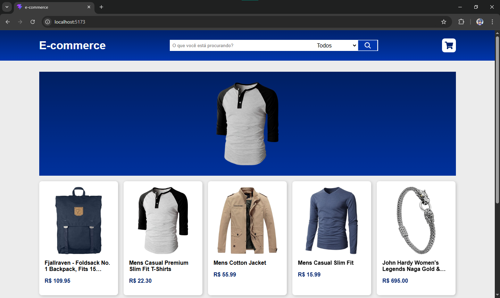

# 📱 E-commerce

Site de um e-commerce desenvolvido após uma análise de concorrência das lojas online mais populares e inspirado nelas.

---

## 👁️ Visualização



---

## 🎯 Objetivo
Demonstrar conhecimento prático no desenvolvimento de e-commerces funcionais, aplicando conceitos modernos de componentização, gerenciamento de estado e design responsivo.

---

## 🛠️ Tecnologias e Conceitos
O projeto foi construído utilizando as melhores práticas do front-end:

* **React**: Biblioteca principal para a construção da interface modular e baseada em componentes.
* **TypeScript**: Adicionado para garantir tipagem estática, reduzindo bugs em tempo de desenvolvimento e melhorando a manutenção do código.
* **CSS Modules & SCSS**: Utilizados em conjunto para estilização escopada, evitando conflitos de classes e permitindo o uso de variáveis e aninhamentos avançados.
* **Mobile First**: Metodologia de design focada em criar a experiência ideal para telas menores primeiro, expandindo progressivamente para desktop.
* **React Icons**: Biblioteca para inclusão de ícones leves e customizáveis na interface.
* **React Router Dom**: Gerenciamento de rotas internas para navegação fluida entre a página principal e a tela de detalhes do produto sem recarregar a página.
* **Hooks**: Uso de `useState`, `useEffect` e custom hooks para controle de estados globais (como carrinho e busca) e ciclo de vida.

---

## 📐 Estrutura da Aplicação

### **Outset** (Página Principal)
* **Header**: Menu de navegação com barra de pesquisa, categorias e acesso ao carrinho.
* **ListProducts**: Grid responsivo que renderiza a lista completa de produtos.
  * **ProductCarrosel**: Carrossel destacado para promoções ou produtos específicos.
  * **ProductCard**: Card individual com foto, preço, título e botão de ação do item.

### **ProductScreen** (Tela de Produto Único)
* **Header**: Mantido para navegação consistente em todas as telas.
* **AboutProduct**: Seção detalhada com especificações, imagens ampliadas e opções de compra do item selecionado.

---

## 🔄 Como Rodar o Projeto
Para executar este projeto localmente, siga os passos abaixo:

1. Clone o repositório:
  ```bash
  git clone [https://github.com/Herdes-s/E-commerce](https://github.com/Herdes-s/E-commerce)
  ```

2. Acesse a pasta do projeto:
  ```Bash
  cd E-commerce
  ```

3. Instale as dependências:
  ```Bash
  npm install
  ```

4. Inicie o servidor de desenvolvimento:
  ```Bash
  npm start
  ```

O projeto abrirá automaticamente no seu navegador no endereço http://localhost:3000.

## 🧠 Desafios e Aprendizados
Durante o desenvolvimento, enfrentei desafios que me permitiram evoluir tecnicamente:

Ajustar a barra de pesquisa para as duas telas

Solução: Como a barra de pesquisa precisava funcionar de forma dinâmica tanto na página inicial quanto na tela de produto único, implementei a elevação de estado (lifting state up) combinada com o React Router Dom. Ao digitar um termo na tela de detalhes, o usuário é redirecionado para a listagem principal com os produtos filtrados automaticamente, garantindo uma experiência de usuário fluida e sem quebras de lógica.

---

## 🔗 Link de Acesso
Confira o projeto online: [**Visualizar E-commerce**](https://e-commerce-gilt-psi-72.vercel.app/)

---

## 👤 Autor
Desenvolvido por Ernand Soares.
